## MERN Stack shopping app

- react 16.8.6
- next 9.1.1
- MongoDB Atlas
- Stripe for checking out
- Cloudinary image platform
- [Heroku deployment](https://olliebrownlow-react-reserve.herokuapp.com/)

## Getting started

Clone the repo, navigate to the root directory and run `npm install` to install the dependencies.

## To start the server

Run `npm run dev`. The server will start on localhost 3000 by default.

## Deployment on Heroku

To interact with the app online, head [here](https://olliebrownlow-react-reserve.herokuapp.com/).

To checkout a cart, use 4242 4242 4242 4242 for the card number.

## Screenshots and features

- Signup page:

  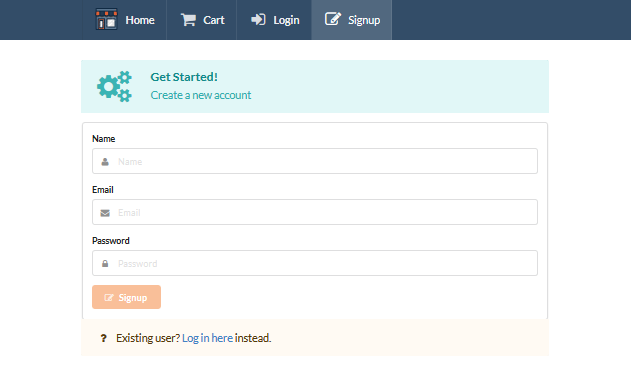

 

- Login page:

  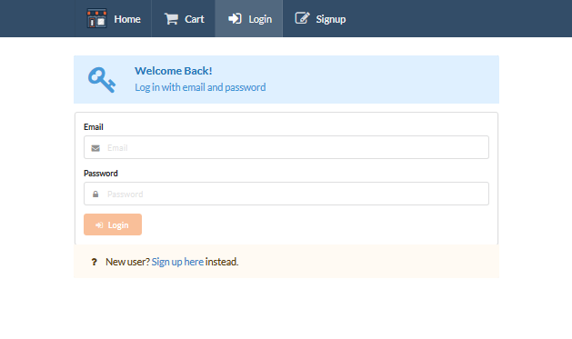

 

- Home page:

  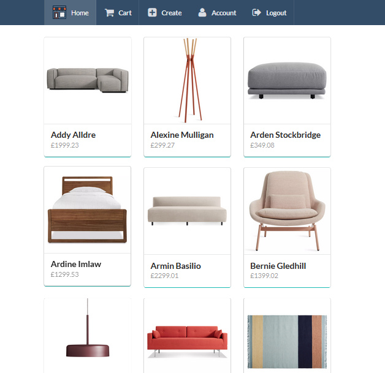

 

- Products are paginated:

  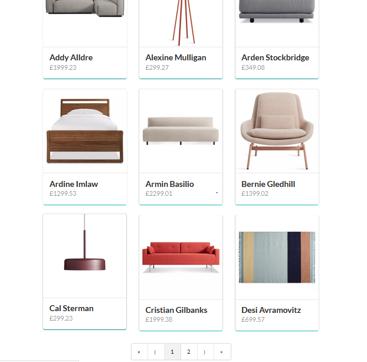

 

- Products can be individually viewed and added to your cart. Only root and admin users can delete products:

  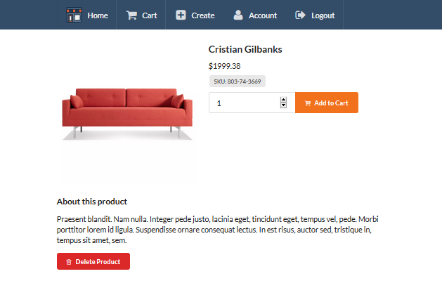

 

- Cart items appear with images and a remove button:

  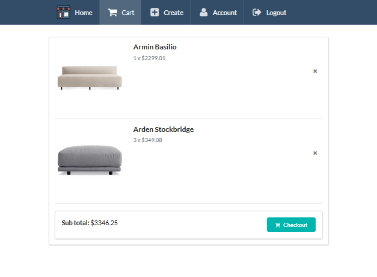

 

- Checkout managed with Stripe in test mode:

  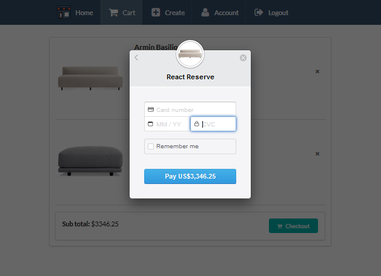

 

- Cart is emptied after checkout:

  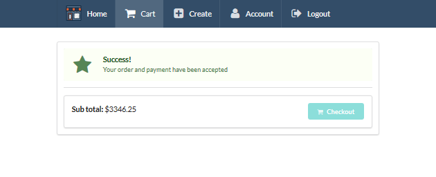

 

- Order history shown in user's account page:

  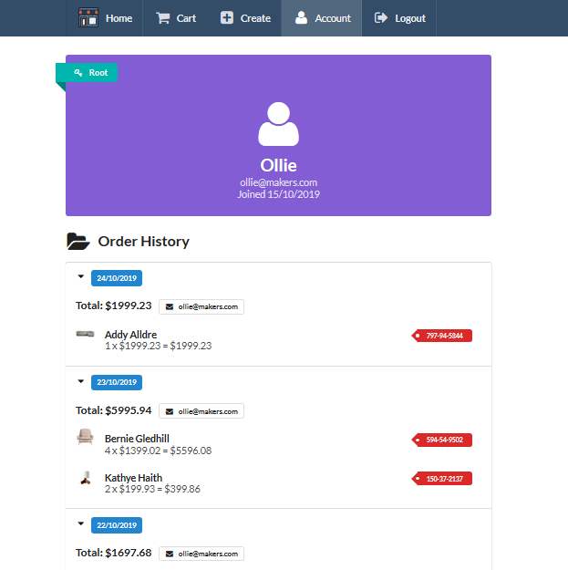

 

- Root and admin users can create new products:

  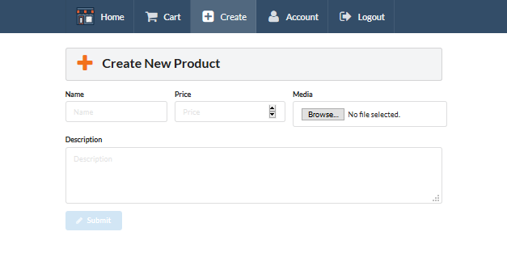

 

- Root users can change user permissions:

  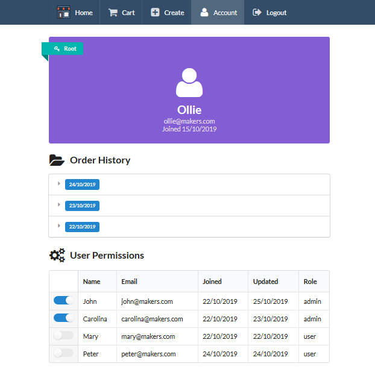
